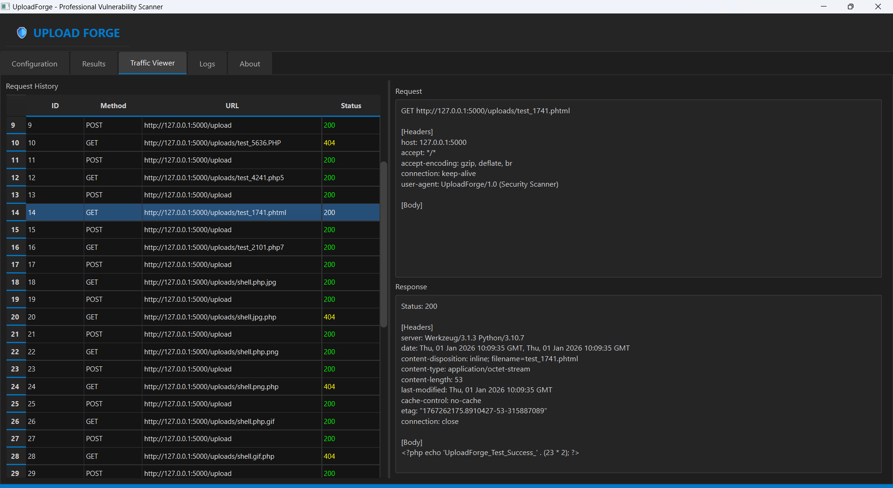
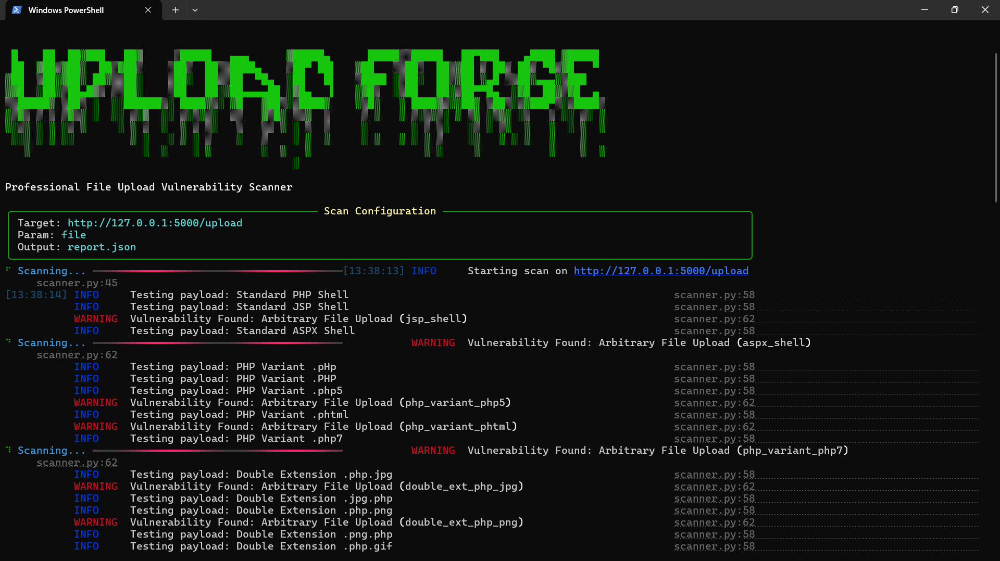

# Upload Forge 🛡️

**Professional File Upload Vulnerability Scanner**

  

Upload Forge is a powerful, production-grade security tool designed to detect and exploit file upload vulnerabilities in web applications. Built for penetration testers and security researchers, it automates the process of testing file upload forms against a wide variety of bypass techniques.

## ✨ Key Features

- **🚀 Async Scanning**: High-performance scanning engine powered by `httpx` and `asyncio`.
- **🕵️ Advanced Detection Logic**:
  - **Extension Bypasses**: Double extensions (`.php.jpg`), case sensitivity (`.pHp`), and rare extensions (`.phtml`, `.php5`).
  - **Magic Byte Spoofing**: Generates payloads with fake headers (e.g., PNG, GIF89a) to bypass content inspection.
  - **Null Byte Injection**: Detects older backend vulnerabilities (`shell.php%00.jpg`).
  - **Polyglots**: Creates valid image files that also contain executable code.
- **🖥️ Modern GUI**: A beautiful, dark-themed graphical interface built with PySide6 for easy configuration and real-time monitoring.
- **💻 Rich CLI**: A feature-packed command-line interface with progress bars, tables, and detailed logging.
- **📊 Reporting**: Generates professional HTML and JSON reports.
- **🛡️ Verification**: Automatically verifies vulnerabilities by attempting to access and execute uploaded files.

## 📦 Installation

1.  **Clone the repository**:
    ```bash
    git clone https://github.com/errorfiathck/upload_forge.git
    cd upload-forge
    ```

2.  **Install dependencies**:
    ```bash
    pip install -r requirements.txt
    ```

## 🚀 Usage

### Graphical Interface (GUI)
Launch the modern dashboard:
```bash
python upload-forge.py gui
```


### Command Line Interface (CLI)
Run a scan directly from your terminal:

```bash
python upload-forge.py scan --url http://target.com/upload --param file --upload-dir http://target.com/uploads/
```

**Options:**
- `--url`: Target upload URL (Required).
- `--param`: Name of the file input parameter (Default: `file`).
- `--upload-dir`: URL where uploaded files are stored (for verification).
- `--proxies`: Proxy string (e.g., `http://127.0.0.1:8080`).


## 🧪 Testing

A vulnerable Flask application is included for testing purposes.

1.  Start the vulnerable server:
    ```bash
    python vulnerable_app.py
    ```
2.  Run the scanner against it:
    ```bash
    python upload-forge.py scan --url http://127.0.0.1:5000/upload --upload-dir http://127.0.0.1:5000/uploads/
    ```

## ⚠️ Disclaimer

This tool is for **educational and authorized testing purposes only**. Do not use it on systems you do not have explicit permission to test. The authors are not responsible for any misuse.

## 🤝 Contribution

Contributions are welcome! Please submit a Pull Request or open an Issue.

---
*Built with ❤️ by ErrorFiat*
